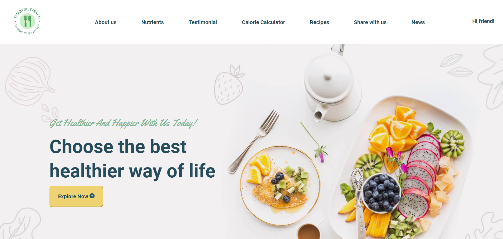
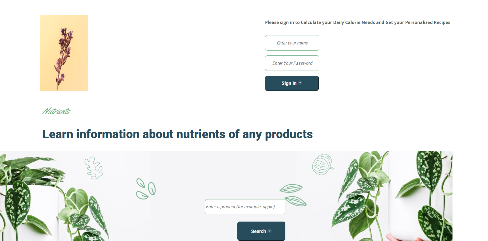
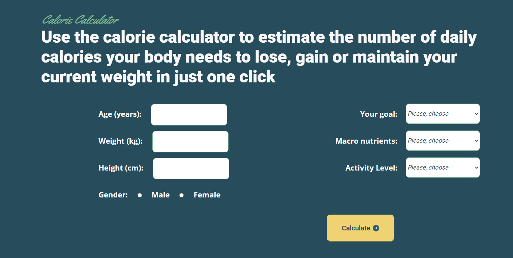
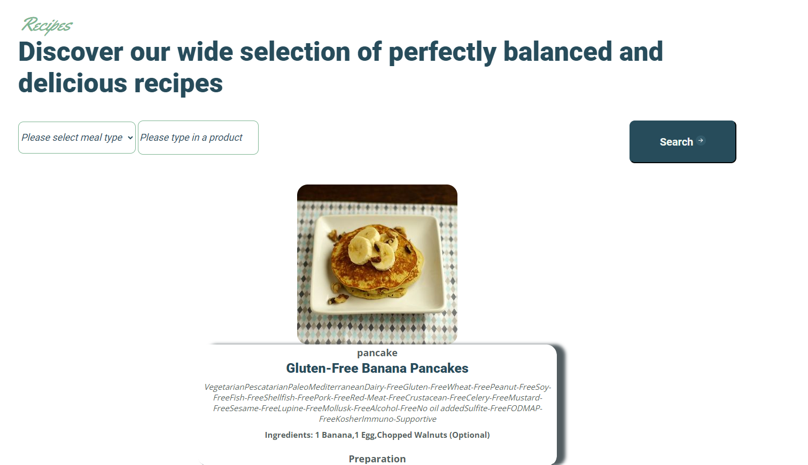
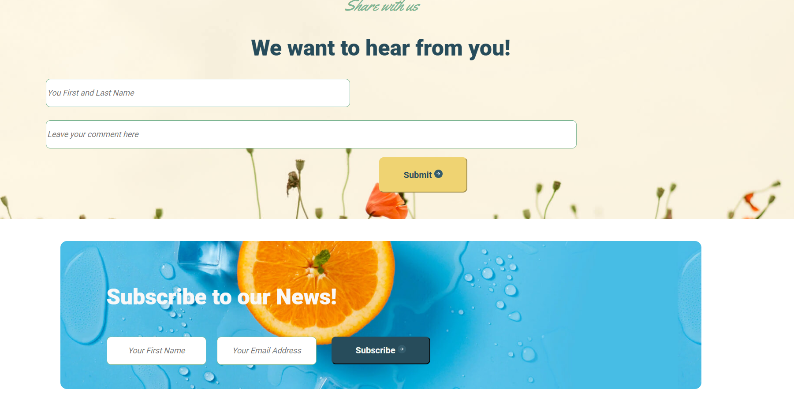

# SmartDietTrack
Eat smart - it’s easy and tasty! :)

/ https://nastyaclifford.github.io/SmartDietTrack_JS/ /

## Website Design
https://www.figma.com/file/FBaI8hSPn5Exv6TCKNzXxh/Healthy-Eating-Template?type=design&node-id=1-430&mode=design&t=YPWvXlBIFaEtEXLM-0

Design was developed using a free Figma template https://www.figma.com/file/NzUxmldLBgTid1UN0AiwJF/Agriculture-Webflow-Website-Template-(Community)?type=design&node-id=2-9967&mode=design&t=26za1y9YxPiBUaVe-0

## Website Description

SmartDietTrack is a website for getting information about key nutrients in foods, calculating your daily calorie intake, and finding healthy, balanced recipes.
The goal of the project was to create a functional, interactive website built on HTML, SASS, JavaScript, API.
The website is used for educational purposes only and is not used for commercial purposes.

It is a single page website with a modal box. 

## Technologies & tools 

* JavaScript
* HTML5
* SASS, CSS
* GitHub
* APIs (https://fitness-calculator.p.rapidapi.com, https://www.edamam.com/,   https://type.fit/api/quotes). All APIs used at work are used solely for educational purposes and are not used for commercial purposes.

## Website Structure

1. Header with the links to the website sections and a sign-in form. JavaScript was used for developing a hamburger-menu. 

2. Banner with the button to open a modal box with the main information about the website. Built with JS. 

3. Sign-in form. Javascript was used for displaying a user name in the header section. 

4. Form for getting information about key nutrients of foods. For developing this form we used JS and free API https://www.edamam.com/. When you type in a product name in the input, you can see hints, which were also taken from API Edamam.

5. Section with the user’s reviews. The reviews are displayed as a slider, which was built on JS.

6. Daily calories intake calculator. For creating the calculator we used JS and free API https://fitness-calculator.p.rapidapi.com. The user is required to type in his/her parameters, such as height, weight, sex, goal), and the calculator will calculate their daily calorie limit. 

7. Recipy finder form. We used JS and free API  https://www.edamam.com/ for developing this section. User can select meal type and an ingredient that will be used for cooking. Recipies are shown in random order. 

8. Form for submitting a comment. Built on JS.

9. Form for news subscription. For developing this form we used JS and free API with quotations https://type.fit/api/quotes. After submitting data, the user will see a motivational message.

10. Footer with the links to the website sections. 

## Set up instruction

git clone https://github.com/nastyaclifford/SmartDietTrack_JS.git

## Thanks to all contributors! 

